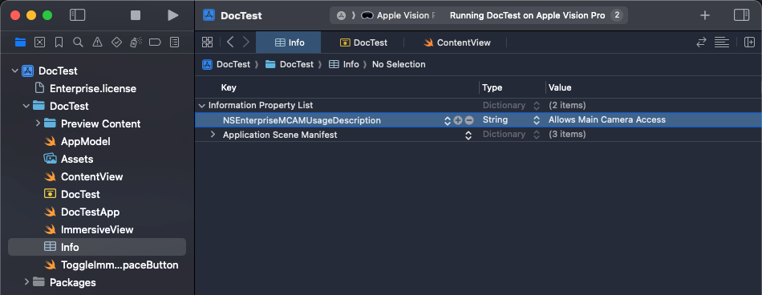
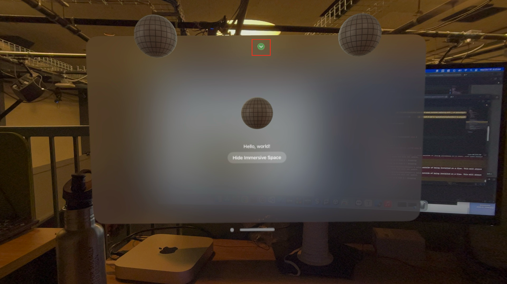

# Main Camera Access

## Setting Up a New VisionOS Xcode Project

Follow these steps to create your first VisionOS app:

1. Open Xcode.
2. Navigate to `File -> New -> Project -> visionOS -> App`.
3. Enter your **Product Name** and click `Next`.

For more details, refer to the official guide: [Creating your first VisionOS app](https://developer.apple.com/documentation/visionos/creating-your-first-visionos-app).

## Enterprise API Setup

1. **Add the License File:**
   - Go to `File -> Add Files to "MyApp"`.
   - Select the `Enterprise.license` file and check the box to **Copy files to destination**.
   - Click `Finish`.

2. **Add Entitlement for Main Camera Access:**
   - Select your project in the **Project Navigator**.
   - Go to the **Signing & Capabilities** tab for the target.
   - Click the **+** button to add a new capability.
   - Search for **Main Camera Access** and double-click to add it. This will create a `.entitlements` file with the capability `com.apple.developer.arkit.main-camera-access.allow`.

3. **Edit `Info.plist`:**
   - Add the key `NSEnterpriseMCAMUsageDescription` and provide a description for the main camera usage.



For more details, check out: [Building Spatial Experiences for Business Apps with Enterprise APIs](https://developer.apple.com/documentation/visionOS/building-spatial-experiences-for-business-apps-with-enterprise-apis).

## Main Camera Access API

Here is an example of how to modify `ContentView.swift` to integrate example codes from [WWDC24 session 10139](https://developer.apple.com/videos/play/wwdc2024/10139/?time=216). 

```swift
// ContentView.swift
import SwiftUI
import RealityKit
import RealityKitContent
import ARKit

struct ContentView: View {
    @State private var pixelBuffer: CVPixelBuffer? = nil

    var body: some View {
        VStack {
            Model3D(named: "Scene", bundle: realityKitContentBundle)
                .padding(.bottom, 50)

            Text("Hello, world!")

            ToggleImmersiveSpaceButton()
        }
        .padding()
        .task {
            await startCameraSession()
        }
    }
    
    private func startCameraSession() async {
        // Main Camera Feed Access Example copied from WWDC24 session 10139
        let formats = CameraVideoFormat.supportedVideoFormats(for: .main, cameraPositions:[.left])
        let cameraFrameProvider = CameraFrameProvider()

        var arKitSession = ARKitSession()
        var pixelBuffer: CVPixelBuffer?

        await arKitSession.queryAuthorization(for: [.cameraAccess])

        do {
            try await arKitSession.run([cameraFrameProvider])
        } catch {
            return
        }

        guard let cameraFrameUpdates =
            cameraFrameProvider.cameraFrameUpdates(for: formats[0]) else {
            return
        }

        for await cameraFrame in cameraFrameUpdates {
            guard let mainCameraSample = cameraFrame.sample(for: .left) else {
                continue
            }
            self.pixelBuffer = mainCameraSample.pixelBuffer
        }
    }
}

#Preview(windowStyle: .automatic) {
    ContentView()
        .environment(AppModel())
}
```

## Running on Vision Pro

1. Build and run the project on a Vision Pro device.

2. When you first open the app, you’ll be prompted to allow access to the Main Camera.

	> Note: Main Camera Access is only available in Immersive Space. Once you toggle the Immersive Space on, you’ll see the camera being accessed, indicated by the green dot on the top of the screen.


